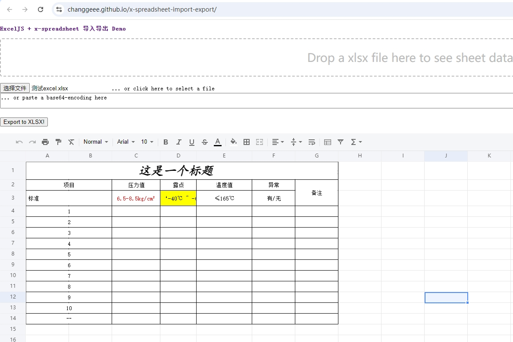

# x-spreadsheet-import-export
xspreadsheet（ https://github.com/myliang/x-spreadsheet ）保留样式的导入编辑及导出demo，基于exceljs（ https://github.com/exceljs/exceljs ）

在线体验(https://changgeee.github.io/x-spreadsheet-import-export/)

效果图:


- 用x-spreadsheet开发时需要用到导入导出功能，找了一堆只找到sheetJs的demo(```https://docs.sheetjs.com/docs/demos/grid/xs```),在线体验（```https://docs.sheetjs.com/xspreadsheet/```）；

- 但是sheetJs要保留样式需要升级pro版本，所以用Excel.js 做了一个简单的实现，基本满足目前的需求

- 原理是导入时把excel的数据格式转换成x-spreadsheet的数据格式，导出时在反过来转换。

- 用sheetJs的demo代码改了这个单文件的示例，如果有人遇到同样的问题直接复制代码修改吧


#### 其他

- 这种方式只适合轻量化的web端表格编辑，如果需求复杂或者使用频率高，建议使用其他技术或商业库，如：
  - SpreadJS（https://www.grapecity.com.cn/developer/spreadjs）
  - SheetJS pro版本 （https://docs.sheetjs.com/docs/）
  - Univer （https://docs.univer.ai/zh-CN/guides/sheets）
  - onlyOffice （https://www.onlyoffice.com/）